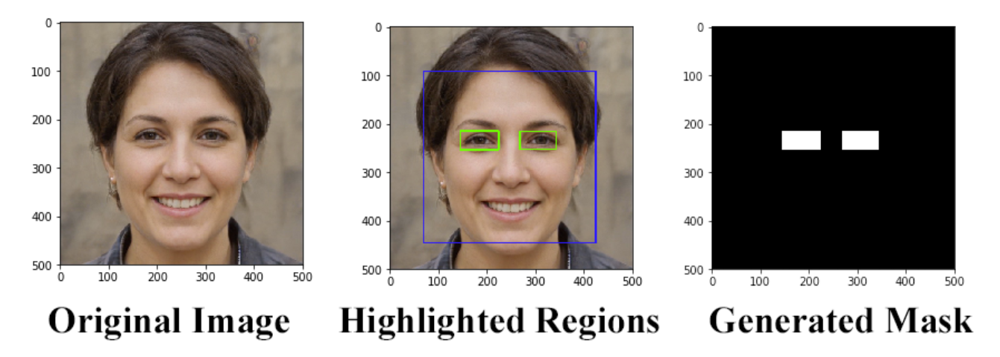

# Eye Detection

This is a pilot work for a larger project on Adversarial Machine Learning. This work utilizes the OpenCV Haarcascade library to detect eye area of human face. It highlights the eye region and generates a mask of the email. The White portion of mask denotes the eye region while the rest of image is blacked out.

## Library used:

- OpenCV (Haarcascades)

## Input - Output

The following barchart depicts the gist of the evaluation results of trained models:

## Source Code and Data

- [CODE](https://github.com/anik801/EyeDetection/blob/main/EyeDetect.ipynb) is the source code for Eye Detection and mask generation.
- [INPUT](https://github.com/anik801/EyeDetection/blob/main/Data) contains the input facial images.
- [OUTPUT](https://github.com/anik801/EyeDetection/blob/main/Output) contains the generated mask.
- [LIBRARY](https://github.com/anik801/EyeDetection/tree/main/haarcascades) contains Haarcascades library.

## Project Team and Contributors

- [Sheik Murad Hassan Anik](https://www.linkedin.com/in/anik801/)
